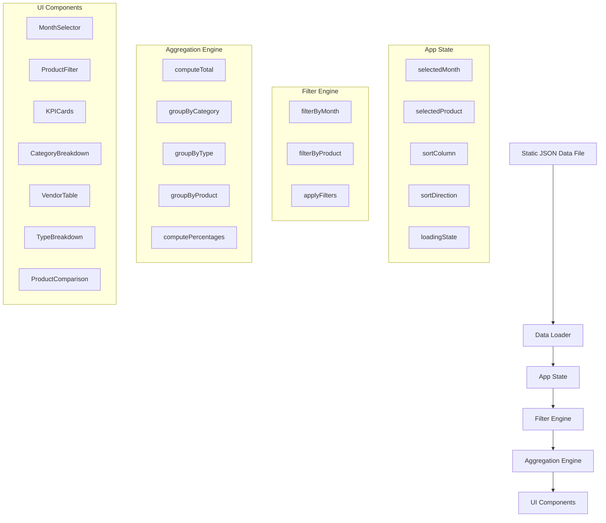
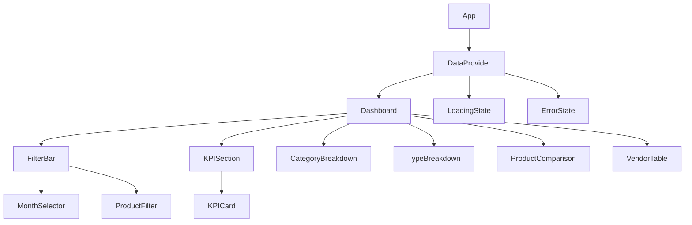

# Design Document: Financial Dashboard

## Overview

The Financial Dashboard is a frontend-only single-page application (SPA) that visualizes monthly operational costs for two products (Coffstack and BitWord). It replaces an existing spreadsheet with an interactive interface providing filtering, aggregation, and comparison capabilities.

The application loads cost data from an embedded JSON file, processes it client-side, and renders interactive views with month/product filtering, KPI summaries, category breakdowns, type analysis, and product comparisons.

**Key Technical Decisions:**
- **Framework**: React with TypeScript — type safety for financial data, component-based architecture fits the dashboard layout, and large ecosystem for charting/tables
- **Build Tool**: Vite — fast development experience, zero-config TypeScript support
- **Styling**: Tailwind CSS — utility-first approach for responsive design, rapid iteration
- **Data Source**: Static JSON file bundled with the app (no backend required)
- **State Management**: React's built-in useState/useReducer — the state is simple (selected month, selected product, sort column/direction)
- **Testing**: Vitest + React Testing Library + fast-check (property-based testing)

## Architecture



The architecture follows a unidirectional data flow:
1. **Data Loading** — JSON file is fetched on app init
2. **State** — User interactions update filter/sort state
3. **Filter Engine** — Pure functions that filter cost entries by month/product
4. **Aggregation Engine** — Pure functions that compute totals, groupings, and percentages
5. **UI Components** — Render computed data reactively

This separation ensures the business logic (filtering, aggregation, formatting) is pure and testable independently of the UI layer.

## Components and Interfaces

### Component Tree



### Component Specifications

#### `App`
Root component. Renders `DataProvider`.

#### `DataProvider`
Responsible for loading cost data and managing loading/error states.

```typescript
interface DataProviderProps {
  children: React.ReactNode;
}
// Provides: CostEntry[], loading: boolean, error: string | null, retry: () => void
```

#### `FilterBar`
Contains the Month and Product filter controls.

```typescript
interface FilterBarProps {
  months: string[];           // Available months (e.g., ["2025-12", "2026-01", ...])
  selectedMonth: string;
  onMonthChange: (month: string) => void;
  selectedProduct: ProductFilter;
  onProductChange: (product: ProductFilter) => void;
  disabled: boolean;
}
```

#### `KPICard`
Displays a single summary metric.

```typescript
interface KPICardProps {
  title: string;
  value: string;          // Pre-formatted currency string
  error?: boolean;
}
```

#### `CategoryBreakdown`
Table grouping costs by category with totals and percentages.

```typescript
interface CategoryBreakdownProps {
  categories: CategorySummary[];
  emptyMessage?: string;
}

interface CategorySummary {
  name: string;
  total: number;
  percentage: number;
  formattedTotal: string;
}
```

#### `TypeBreakdown`
Summary showing Fixed vs Variable cost split.

```typescript
interface TypeBreakdownProps {
  types: TypeSummary[];
}

interface TypeSummary {
  type: "Fixo" | "Variável";
  total: number;
  count: number;
  percentage: number;
  formattedTotal: string;
}
```

#### `ProductComparison`
Side-by-side product cost comparison (visible only when filter is "Todos").

```typescript
interface ProductComparisonProps {
  products: ProductSummary[];
  visible: boolean;
}

interface ProductSummary {
  name: "Coffstack" | "BitWord";
  total: number;
  percentage: number;
  formattedTotal: string;
}
```

#### `VendorTable`
Detailed sortable table of individual cost entries.

```typescript
interface VendorTableProps {
  entries: CostEntry[];
  sortColumn: SortColumn;
  sortDirection: "asc" | "desc";
  onSort: (column: SortColumn) => void;
  emptyMessage?: string;
}
```

### Pure Function Modules

#### `filters.ts`

```typescript
function filterByMonth(entries: CostEntry[], month: string): CostEntry[];
function filterByProduct(entries: CostEntry[], product: ProductFilter): CostEntry[];
function applyFilters(entries: CostEntry[], month: string, product: ProductFilter): CostEntry[];
function getLatestMonthWithData(entries: CostEntry[], availableMonths: string[]): string;
```

#### `aggregations.ts`

```typescript
function computeTotal(entries: CostEntry[]): number;
function groupByCategory(entries: CostEntry[]): CategorySummary[];
function groupByType(entries: CostEntry[]): TypeSummary[];
function groupByProduct(entries: CostEntry[]): ProductSummary[];
function computePercentages<T extends { total: number }>(groups: T[], grandTotal: number): (T & { percentage: number })[];
```

#### `formatters.ts`

```typescript
function formatBRL(value: number): string;    // Returns "R$ X.XXX,XX"
function formatPercentage(value: number, decimals?: number): string;
```

#### `sorting.ts`

```typescript
function sortEntries(entries: CostEntry[], column: SortColumn, direction: "asc" | "desc"): CostEntry[];
```

## Data Models

### Core Types

```typescript
interface CostEntry {
  data: string;           // ISO date string (YYYY-MM-DD) or month format
  produto: "Coffstack" | "BitWord";
  categoria: Category;
  descricao: string;
  fornecedor: string;
  valor: number;          // Value in BRL (numeric)
  tipo: "Fixo" | "Variável";
  essencial: boolean;
  observacoes: string;
}

type Category =
  | "Ferramentas/SaaS"
  | "Taxas e Impostos"
  | "Equipe/Prestadores"
  | "Contabilidade/Jurídico"
  | "Hospedagem/Cloud"
  | "Marketing";

type ProductFilter = "Coffstack" | "BitWord" | "Todos";

type SortColumn = "descricao" | "fornecedor" | "categoria" | "valor" | "tipo" | "essencial";

interface AppState {
  entries: CostEntry[];
  selectedMonth: string;
  selectedProduct: ProductFilter;
  sortColumn: SortColumn;
  sortDirection: "asc" | "desc";
  loading: boolean;
  error: string | null;
}
```

### JSON Data File Structure

The data source (`data/costs.json`) maps directly from the spreadsheet:

```json
[
  {
    "data": "2025-12",
    "produto": "Coffstack",
    "categoria": "Ferramentas/SaaS",
    "descricao": "GitHub Pro",
    "fornecedor": "GitHub",
    "valor": 50.00,
    "tipo": "Fixo",
    "essencial": true,
    "observacoes": ""
  }
]
```

### State Derivation

All displayed data is derived from `AppState` through pure functions:

```
filteredEntries = applyFilters(entries, selectedMonth, selectedProduct)
monthTotal = computeTotal(filteredEntries)
categoryBreakdown = groupByCategory(filteredEntries)
typeBreakdown = groupByType(filteredEntries)
productComparison = groupByProduct(filterByMonth(entries, selectedMonth))
sortedEntries = sortEntries(filteredEntries, sortColumn, sortDirection)
```

Note: Product comparison always uses all products for the selected month (not filtered by product), since its purpose is to compare products side by side.

## Correctness Properties

*A property is a characteristic or behavior that should hold true across all valid executions of a system — essentially, a formal statement about what the system should do. Properties serve as the bridge between human-readable specifications and machine-verifiable correctness guarantees.*

### Property 1: Month filtering returns only matching entries

*For any* set of cost entries and any selected month, filtering by that month SHALL return only entries whose `data` field matches the selected month, and SHALL not omit any entries that do match.

**Validates: Requirements 1.2**

### Property 2: Default month is the latest month with data

*For any* non-empty set of cost entries spanning multiple months, the computed default month SHALL be the chronologically latest month that contains at least one entry.

**Validates: Requirements 1.3**

### Property 3: Product filtering returns only matching entries

*For any* set of cost entries and any product filter value, filtering SHALL return only entries whose `produto` field matches the filter when a single product is selected, or SHALL return all entries when "Todos" is selected.

**Validates: Requirements 2.2, 2.3**

### Property 4: BRL currency formatting

*For any* non-negative number, `formatBRL` SHALL produce a string matching the pattern `R$ X.XXX,XX` where the integer part uses dots as thousands separators, the decimal part uses a comma, and exactly 2 decimal digits are present.

**Validates: Requirements 9.1, 3.1, 4.2**

### Property 5: Category breakdown correctness

*For any* non-empty set of filtered cost entries, grouping by category SHALL produce groups where: (a) every entry is accounted for in exactly one group, (b) each group's total equals the sum of its entries' `valor` values, (c) all group percentages sum to 100% (within rounding tolerance), and (d) groups are sorted in descending order by total.

**Validates: Requirements 4.1, 4.3**

### Property 6: Type breakdown correctness

*For any* set of filtered cost entries (including empty), grouping by type SHALL always produce exactly two groups ("Fixo" and "Variável") where: (a) each group's total equals the sum of matching entries' `valor`, (b) each group's count equals the number of matching entries, and (c) percentages sum to 100% for non-empty sets or are both 0% for empty sets.

**Validates: Requirements 6.1, 6.2, 6.3, 6.4**

### Property 7: Product comparison correctness

*For any* set of cost entries filtered by month, the product comparison SHALL produce exactly two groups ("Coffstack" and "BitWord") where: (a) each group's total equals the sum of that product's entries, and (b) percentages sum to 100% for non-empty sets or are both 0% for empty sets.

**Validates: Requirements 7.1, 7.2, 7.4**

### Property 8: Column sorting correctness

*For any* list of cost entries and any sortable column, sorting SHALL produce a result where consecutive elements are in non-decreasing (ascending) or non-increasing (descending) order according to the selected column, and sorting the same column twice SHALL reverse the order.

**Validates: Requirements 5.3**

### Property 9: Total computation is sum of filtered entries

*For any* set of filtered cost entries, the computed total SHALL equal the arithmetic sum of all `valor` values in that set, and for an empty set SHALL equal 0.

**Validates: Requirements 3.1, 3.2**

## Error Handling

| Scenario | Behavior | User Feedback |
|----------|----------|---------------|
| Data file fails to load (network error, 404) | Catch fetch error, set error state | Display error message with retry button |
| Data file returns invalid JSON | Catch parse error, set error state | Display error message with retry button |
| Load timeout (>10s) | AbortController cancels fetch | Display timeout message with retry |
| Filter produces empty results | Return empty array from filter | Component-level empty state messages |
| Currency value is NaN/undefined | formatBRL guards with fallback | Display "R$ 0,00" |
| Invalid date in data | Skip entry during parsing | Log warning, exclude from dataset |

### Error State Hierarchy

1. **Loading** — Spinner visible, all controls disabled
2. **Error** — Error message + retry button, no data displayed
3. **Ready** — Controls enabled, data rendered
4. **Empty** — Controls enabled, empty state messages in data sections

## Testing Strategy

### Unit Tests (Vitest + React Testing Library)

**Example-based tests for:**
- Component rendering (Month_Selector shows all 8 months, Product_Filter shows 3 options)
- Initial state (default month selection, "Todos" selected, "BRL" label visible)
- Error/loading states (loading indicator, disabled controls, error message with retry)
- Responsive layout behavior (vertical stacking at <768px, scrollable tables)
- Empty state messages display correctly
- Product comparison section hides when single product is selected

**Edge cases covered by property generators:**
- Empty month (no entries for selected month)
- Single product has no entries in comparison
- All entries in one category or one type

### Property-Based Tests (Vitest + fast-check)

Each property test runs a minimum of 100 iterations with randomly generated cost entry sets.

| Property | Module Under Test | Generator |
|----------|------------------|-----------|
| Property 1: Month filtering | `filters.ts` | Random CostEntry[] + random month from available set |
| Property 2: Default month | `filters.ts` | Random CostEntry[] spanning random subset of months |
| Property 3: Product filtering | `filters.ts` | Random CostEntry[] + random ProductFilter |
| Property 4: BRL formatting | `formatters.ts` | Random non-negative numbers (integers, decimals, large values) |
| Property 5: Category breakdown | `aggregations.ts` | Random CostEntry[] with random categories |
| Property 6: Type breakdown | `aggregations.ts` | Random CostEntry[] with random types (including empty sets) |
| Property 7: Product comparison | `aggregations.ts` | Random CostEntry[] with mixed products |
| Property 8: Column sorting | `sorting.ts` | Random CostEntry[] + random column + direction |
| Property 9: Total computation | `aggregations.ts` | Random CostEntry[] (including empty) |

**Tag format for property tests:**
```typescript
// Feature: financial-dashboard, Property 1: Month filtering returns only matching entries
```

### Integration Tests

- Full data loading flow (happy path)
- Filter interactions update all dashboard sections
- Sort toggle behavior on vendor table

### Test File Organization

```
src/
├── utils/
│   ├── filters.ts
│   ├── filters.test.ts          # Unit + property tests
│   ├── aggregations.ts
│   ├── aggregations.test.ts     # Unit + property tests
│   ├── formatters.ts
│   ├── formatters.test.ts       # Unit + property tests
│   ├── sorting.ts
│   └── sorting.test.ts          # Unit + property tests
├── components/
│   ├── Dashboard.tsx
│   ├── Dashboard.test.tsx       # Integration tests
│   ├── FilterBar.test.tsx       # Unit tests
│   ├── KPICard.test.tsx         # Unit tests
│   └── ...
└── data/
    └── costs.json
```
